# SFND_Unscented_Kalman_Filter
Fourth and final project of Udacity Sensor Fusion Nanodegree Program

The purpose of the project is to implement an Unscented Kalman Filter. Data is generated from a simulation of a car, the ego car, driving on a higway. The ego car is equipped with lidar and radar sensors and measures location of three cars in its environment as they move behind, in front and by it. The data is to be fused in a filter for best estimate of each car's two dimensional position, speed and turn rate.

Simulation and starter code is provided. The simulation code generates the measurement data from the surrounding cars. The simulation code also includes all necessary code for visualizing the simulation and its results (see gif above).

Referring to the visualization, the ego car is shown in green. Simluated lidar readings are red dots above and near each traffic car. Simulated lidar readings are purple arrows pointing at traffic cars. Actual velocity relative to the ego car is indicated.

The starter code provides header file for unscented filter implementation and prototypes for the main processing steps in a Kalman filter implementation, i.e. measurement processing, state prediction and measurement update. The student is to fill in the implementation, which was developed in detail in class room lectures.

Finally, the simulation code monitors filter implementation's ability to accurately estimate the cars' state. A successful implementation must pass RMSE (root mean square error) limits. At each step the RMSE is displayed and should the success criteria not be met, a display announcing the failure shows up. To meet the success criteria the student must implement the filter correctly and tune it to meet the accuracy criteria.

The filter implementation assumes the CTRV (Constant Turn Rate and Veolcity Magnitude) model. The simulated velocity and turn rates of traffic cars are non constant. The filter implementation accounts for that by modeling veolcity and rate changes as noise in the state equations. Tuning means setting values for two process noise variances, acceleration and yaw rate.

## Implementation

The Kalman Filter was implemented as instructed in the classroom and developed over a course of exercises. A few changes and additions were made.

### Command line arguments

Command line arguments were added to aid development and testing. The user can select to simulate any of the three traffic cars solely or all three. Simluations can use lidar or radar only or both. Values for the two tuning parameters can be set both or individually. Finally, a standard Kalman Filter update can be used instead of the sigma point measurement estimation method. If no command line options are set, defaults using all three traffic cars, both sensors, simga point measurement and the final tuning parameters is used. That is the configuration to run when verifying that the RMSE criteria have been met for the project.

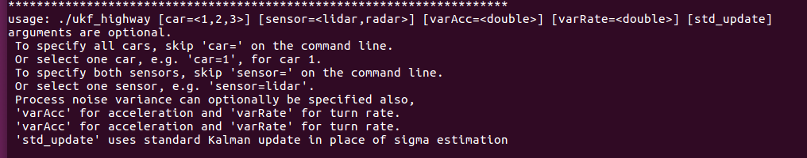

### Performance plots

Two plots are presented during and after the simulation.

#### Normalized Innovation Squared

The first is NIS (Normalized Innovation Squared). NIS is an indicator of proper tuning. Proper tuning is attained when the predicted measurement in the update step is within statistical bounds of the actual measurement. If the discrepancy is either consistently too large or too small the tuning is off. It is also possible that the modeling of the real process is wrong but that is a different matter. The NIS, a scalar, follows the Chi-squared distribution. Expected targets can be set based on the number of measurement variables ("degrees of freedom").

Below is an example NIS plot. The simulation uses traffic car #3 only. This car starts behind the ego, turn left and passes the ego car. The horizontal lines in thr NIS plot represent the Chi-squared limits applicable to the two measurement update types, lidar and radar.

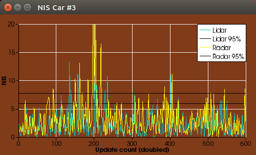

#### Estimation Error

The second plot is the error of the modeled variables, velocity and yaw or turn rate. The base model assumes these are constant. But in real life situations they rarely are and not in this simularion. To account for their non-constancy, a noise, process noise, is added to the filter's statistical model. This is done by augmenting the state, i.e. adding state variables. We add two state variables, one for acceleration and yaw rate each, and model them as purely driven by noise. Augmentation using noise models is a standard Kalman Filter trick.

It stands to reason that we wish to see how well the filter performs by plotting the error in these state variables. The error is defined as the difference between the actual simulated value, or ground truth, and the filter's estimated value. A successful filter will exhibit very small errors, certainly errors approaching zero asymptotically, if a steady state is attained.

Below is an example error plot. Again, the simulation uses traffic car #3 only. 

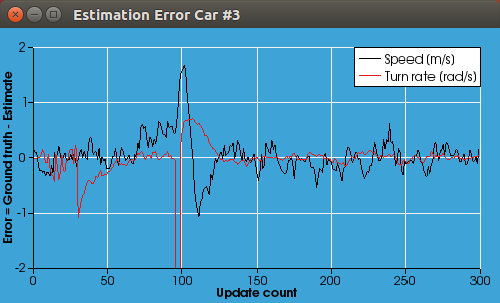

### Measurement Update

The Kalman Filter applies to linear systems corrputed by Gaussian distributed zero mean noise. Most systems are not linear. The Unscented Kalman Filter is a way to use Kalman Filter methods to non-linear systems.

Non-linearity can be either in the process or measurement. This project presents both. A vehicle moving along a curved path is a non-linear process in a Euclidean space. A radar data update is non-linear but a lidar data update is linear.

The Kalman filter is a two step process: prediction and update. The purpose of prediction is to estimate the state and covariance of the system just prior to applying the update. The purpose of the update is to re-estimate the state vector and its covariance using a measurement. An update only needs a valid mean and covariance; how the mean and covariance were obtained does not matter. I figure that in an Unscented implementation a linear update can be used with a sigma points state and covariance prediction.

Therefore the standard Kalman Filter update was implemented in addition to the sigma point estimation of the measurement. A command line option can select the standard update, but the sigma point method is default. The image below shows the result of simulating car #2 only using both sensors using the two methods of update. There is no discernible difference between them. We would have expected some difference between the two. But if both methods of update are equally valid, and noise simulation is the same in the two runs, the results will be identical.

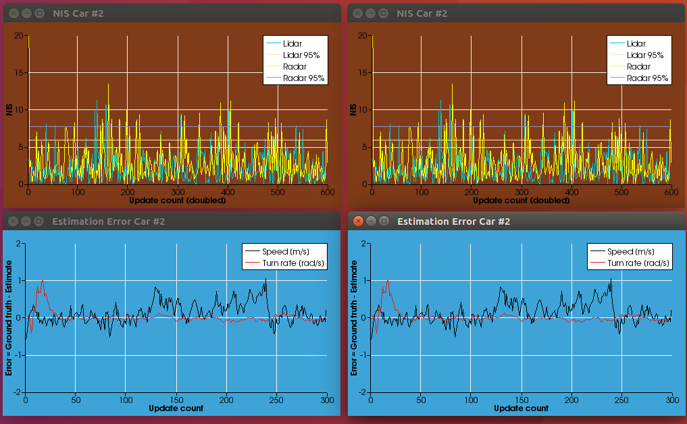

## Results

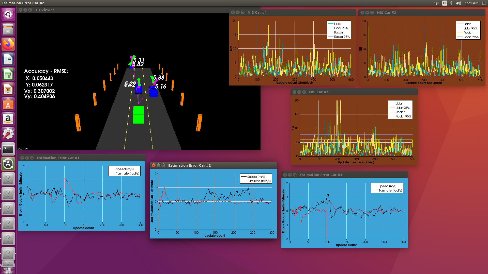

The Unscented Kalman Filter was implemented successfully and tuned. The original values for acceleartion noise and yaw rate variances were set at 30, which was found to be grossly too large. After some expeimentation it was found that acceleration noise variance should be in the range  1  to 5, yaw rate variance in the range 1 to 7. This range was successful in meeting the RMSE criteria. The combination of acceleration variance of 3 and yaw rate variance of 1 was perhaps best. See the image immediately below.

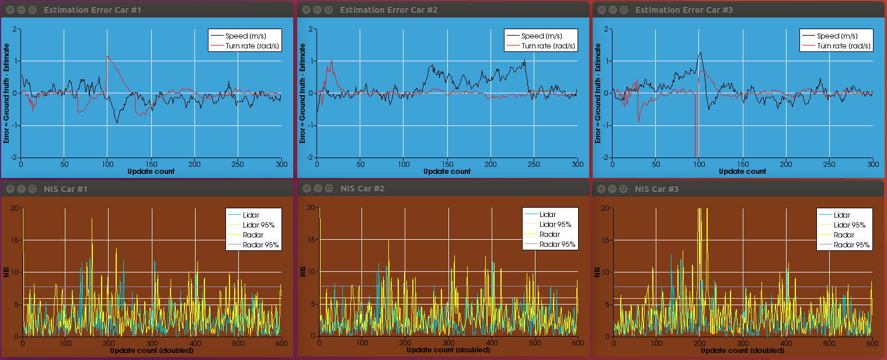

The image below shows results for a borderline case of accelearion variance of 5 and yaw rate variance of 7.

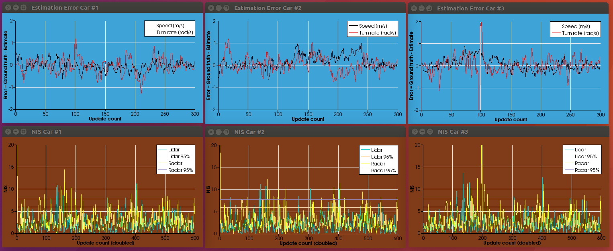

An observation can be made that the NIS plots are not a sensitive tool for adjusting the variance to meet the RMSE criteria. The above image passed the RMSE test with while showing good NIS values. However the error estimates indicate the filter struggles to suppress the errors. The error plots are the main indicator of estimation quality.

Another interesting point to make is that the RMSE test can pass with all three traffic cars, but fail with the cars run individually. Below are the cases of running each car individually where only car 3 passes. My explanation is that the RMSE test is an average of RMSE for all cars. If the test is performed when one car is in excellent agreement with the ground truth and the others not, their average RMSE value may be under the limit. The images below show the results of running each car individually at the optimal tuning pesented above. Only the bottom image for traffic car 3 passed the RMSE test.

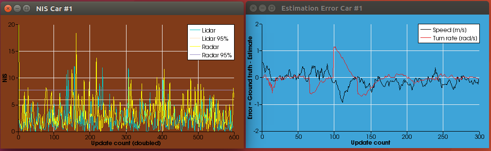

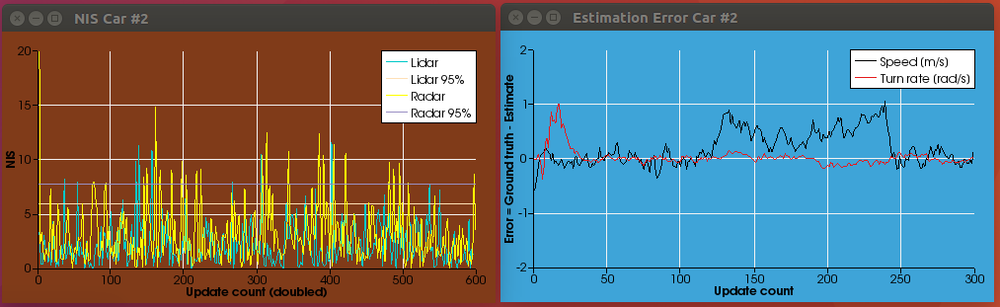

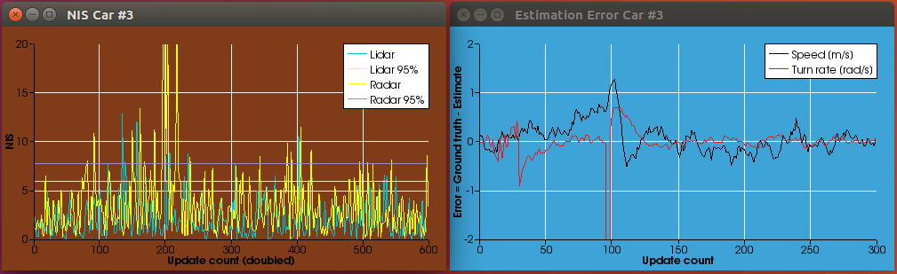

Finally, the images below show results for simulating traffic car 3 as before but this time with lidar or radar updates only. The lidar only simulation passes the RMSE test but radar only fails.

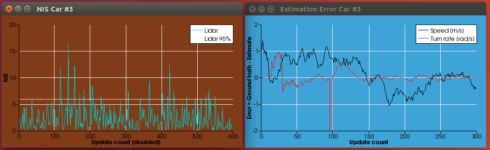

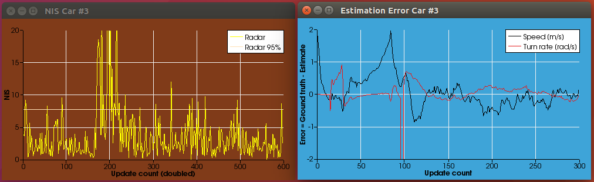
